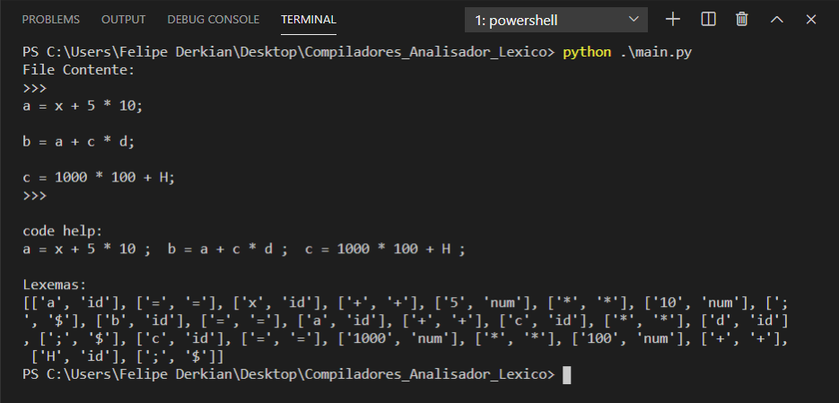

# ANALISADOR LÉXICO SIMPLES EM PYTHON3

## COMO ELE FUNCIONA?

  * Certifique-se de criar na mesma pasta do executável um arquivo chamado **cod.txt** com expressões do tipo Ex.: `conta = X + (B * C) + 12;`
  * Execute o código fonte pelo terminal com a intrução `python main.py`. (_Deve estar no mesmo diretório que o código fonte_).

## FUNCIONAMENTO DO ANALISADOR LÉXICO PODE SER VISTO NA IMAGEM ABAIXO

# OBRIGADO PELA ATENÇÃO.
